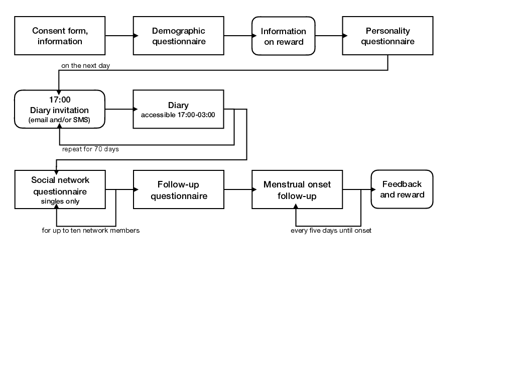

```{r}
source("0_helpers.R")
load("data/cleaned_selected.rdata")
opts_chunk$set(warning = F, message = F, error = T)
all_surveys <- all_surveys %>% 
  mutate(relationship_duration = duration_relationship_years + duration_relationship_month/12)

library(knitr)
opts_chunk$set(fig.width = 9, fig.height = 7, cache = T, warning = F, message = F, cache = F, error = T)
library(kableExtra)
```

## Study flow chart
```{r fig.cap="Flow chart of the steps of the menstrual cycle diary study.",fig.width=8,fig.height=8}

```

```{r}
began_s1_demo = sum(!is.na(s1_demo$created))
ended_s1_demo = sum(!is.na(s1_demo$ended))
diary <- s1_filter %>% left_join(diary, by = c('session', 'short'), suffix = c("_filter", ""))
ended_pre = diary %>% filter(!is.na(ended_initial)) %>% ungroup() %>% summarise(n = n_distinct(session)) %>% pull(n)
diary %>% group_by(gets_paid) %>% summarise(n = sum(!is.na(ended_initial[!duplicated(session)]), n = n_distinct(session)))
at_least_one_diary_entry = diary %>% group_by(session) %>% summarise(n = n_nonmissing(ended_diary)) %>% filter(n >= 1) %>% nrow()
at_least_20_diary_entries = diary %>% group_by(session) %>% summarise(n = n_nonmissing(ended_diary)) %>% filter(n >= 20) %>% nrow()
at_least_50_diary_entries = diary %>% group_by(session) %>% summarise(n = n_nonmissing(ended_diary)) %>% filter(n >= 50) %>% nrow()

in_relationship = sum(s1_demo$hetero_relationship, na.rm = T)
singles = sum(! s1_demo$hetero_relationship, na.rm = T)

at_least_one_diary_entry = s3_daily %>% group_by(session) %>% summarise(n = n_nonmissing(ended)) %>% filter(n >= 1) %>% nrow()
at_least_20_diary_entries = s3_daily %>% group_by(session) %>% summarise(n = n_nonmissing(ended)) %>% filter(n >= 20) %>% nrow()
at_least_50_diary_entries = s3_daily %>% group_by(session) %>% summarise(n = n_nonmissing(ended)) %>% filter(n >= 50) %>% nrow()

mean_diary_entries <- s3_daily %>% group_by(session) %>% summarise(n = n_nonmissing(ended)) %>% summarise(mean(n))

mean_diary_entries_by_payment <- s1_filter %>% 
  select(-ended) %>% left_join(s3_daily, by = 'session') %>% 
  group_by(gets_paid, session) %>%
  summarise(n = n_nonmissing(ended)) %>% 
  filter(n > 0) %>% 
  group_by(gets_paid) %>% 
  summarise(responses = mean(n), n = n_distinct(session))

response_rate_over_time <- diary %>% 
  filter(day_number >= 0, day_number < 70) %>% 
  left_join(s1_filter, by = 'session', suffix = c("", "_filter")) %>% 
  group_by(gets_paid) %>% 
  mutate(
    n = n_distinct(session)
  ) %>% 
  group_by(gets_paid, day_number) %>% 
  summarise(
    n = unique(n),
    entries = n_nonmissing(ended_diary),
    rr = entries / unique(n))

ggplot(response_rate_over_time, aes(day_number, rr, colour = gets_paid)) + geom_point() +
    ggtitle("Response rate over time", "for people who started the diary") + ylim(0,1)

mean_diary_entries_finishers <- s4_followup %>% select(-ended) %>% left_join(s3_daily, by = 'session') %>% group_by(session) %>% summarise(n = n_nonmissing(ended)) %>% summarise(mean(n))

response_rate_over_time <- s4_followup %>% select(-ended) %>% 
  left_join(diary %>% select(session, day_number, created_diary, ended_diary)) %>% filter(day_number >= 0, day_number < 70) %>% 
  left_join(s1_filter, by = 'session', suffix = c("", "_filter")) %>% 
  group_by(gets_paid) %>% 
  mutate(
    n = n_distinct(session)
  ) %>% 
  group_by(gets_paid, day_number) %>% 
  summarise(
    entries = n_nonmissing(ended_diary),
    rr = entries / unique(n))

ggplot(response_rate_over_time, aes(day_number, rr, colour = gets_paid)) + 
  geom_point() +
    ggtitle("Response rate over time", "for people who finished the diary") + ylim(0,1)

response_rate_over_time <- diary %>% 
  # I am leaving in days that we excluded post-hoc (e.g., because fertility was not estimable, to show the real response rate, irrespective of diary-data-based exclusions)
  filter(reasons_for_exclusion == reasons_for_exclusion_diary) %>% 
  select(session, day_number, created_diary, ended_diary) %>% 
  filter(day_number >= 0, day_number < 70) %>% 
  left_join(s1_filter, by = 'session', suffix = c("", "_filter")) %>% 
  group_by(gets_paid) %>% 
  mutate(
    n = n_distinct(session)
  ) %>% 
  group_by(gets_paid, day_number) %>% 
  summarise(
    n = unique(n),
    entries = n_nonmissing(ended_diary),
    rr = entries / unique(n))

ggplot(response_rate_over_time, aes(day_number, rr, colour = gets_paid)) + 
  geom_point() +
    ggtitle("Response rate over time", "for included subsample") + ylim(0,1)

nsmt2d_over_time <- s4_followup %>% select(-ended) %>% 
  left_join(diary %>% select(session, day_number, never_skipped_more_than_2, created_diary, ended_diary)) %>% 
  left_join(s1_filter, by = 'session', suffix = c("", "_filter")) %>% 
  left_join(mean_diary_entries_by_payment) %>% 
  group_by(gets_paid, day_number) %>% 
  summarise(entries = sum(as.numeric(never_skipped_more_than_2), na.rm = T),
            rr = entries / unique(n))

ggplot(nsmt2d_over_time, aes(day_number, rr, colour = gets_paid)) + 
  geom_point() +
    ggtitle("Percentage who never skipped more than two days over time", "for people who finished the diary") + ylim(0,1)


mean_finishing_personality_by_payment <- s1_demo %>% 
  left_join(s1_filter, by = 'session', suffix = c("_demo", "")) %>% 
  left_join(s2_initial,by ='session', suffix = c("", "_initial")) %>% 
  group_by(gets_paid) %>% 
  summarise(finish_demo = n_nonmissing(ended_demo), 
            finish_initial = n_nonmissing(ended_initial), n = n(),
            prc_ini_over_demo = round(100*finish_initial/finish_demo),
            consc = mean(bfi_consc,na.rm=T))
kable(mean_finishing_personality_by_payment)

mean_finishing_follow_up_by_payment <- s1_filter %>% select(-ended) %>% right_join(s2_initial,by ='session') %>% left_join(s4_followup, by = 'session', suffix = c("_initial", "_followup")) %>% group_by(gets_paid) %>% summarise(followup = n_nonmissing(ended_followup), initial = n_nonmissing(ended_initial), n(), prc_fu_over_initial = round(100*followup/initial))
kable(mean_finishing_follow_up_by_payment)

fertile_known_man_known = diary_social %>% group_by(session, created) %>% 
  summarise(n = n_nonmissing(person_attractiveness_short_term)) %>% 
  group_by(session) %>% summarise(n = sum(n)) # fertility known, man known
fertile_known_man_known$n %>% qplot() + xlim(1,NA)

fertile_known_person_known = diary_social %>% group_by(session, created) %>% 
  summarise(n = n_nonmissing(person_sex)) %>% 
  group_by(session) %>% summarise(n = sum(n)) # fertility known, man known

finished_timespent = s4_timespent %>% group_by(session) %>% summarise(n = n_nonmissing(ended)) %>% filter(n >= 1) %>% nrow()
timespent_gt3 = s4_timespent %>% group_by(session) %>% summarise(n = n_nonmissing(ended)) %>% filter(n > 3) %>% nrow()
timespent_men = network %>% group_by(session) %>% filter(person_sex == 2, person_relationship_to_anchor != "biological_relative") %>% summarise(n = n_nonmissing(ended)) %>% filter(n > 0) %>% nrow()
timespent_3men = network %>% group_by(session) %>% filter(person_sex == 2, person_relationship_to_anchor != "biological_relative") %>% summarise(n = n_nonmissing(ended)) %>% filter(n > 2) %>% nrow()

fertile_known_man_known_participants = fertile_known_man_known %>% filter(n > 0) %>% nrow()
fertile_known_person_known_participants = fertile_known_person_known %>% filter(n > 0) %>% nrow()

finished_followup = sum(!is.na(s4_followup$ended))

# all_surveys %>% mutate(
#   should_be_done = created_demo + days(70) < today()
# ) %>% filter(should_be_done == T) %>% xtabs(~ is.na(ended), .)

# all_surveys %>% mutate(
# should_be_done = created_demo + days(70) < today()
# ) %>% left_join(s3_daily %>% group_by(session) %>% summarise(n = n_nonmissing(ended))) %>% 
#  filter(should_be_done == T, n > 40) %>% xtabs(~ is.na(ended), .)

all_surveys %>% mutate(should_be_done = created_demo + days(70) < today()) %>%
 left_join( s4_timespent %>% group_by(session) %>% summarise(n_timespent = n_nonmissing(ended)), by = 'session') %>% 
 filter(hetero_relationship == 0, should_be_done == T, n_timespent > 0, !is.na(n_timespent)) %>% nrow()

all_surveys %>% mutate(should_be_done = created_demo + days(70) < today()) %>%
 left_join( s4_timespent %>% group_by(session) %>% summarise(n_timespent =  n_nonmissing(ended)), by = 'session') %>% 
 filter(hetero_relationship == 0 & should_be_done == T & (is.na(n_timespent) | n_timespent == 0)) %>% nrow()
```

1. __`r began_s1_demo`__ signed up for the study.
2. __`r ended_s1_demo`__ finished the demographics (`r singles` singles, `r in_relationship` in relationship).
2. __`r ended_pre`__ finished the demographic and personality questionnaires.
3. __`r at_least_one_diary_entry`__ submitted at least one diary entry (>= 20: `r at_least_20_diary_entries`, >= 50 `r at_least_50_diary_entries`). On average participants completed `r mean_diary_entries` diary entries.
4. `r finished_timespent` singles reported information on least one person mentioned during the diary (>3: `r timespent_gt3`, at least one man who wasn't biologically related: `r timespent_men`, >2men: `r timespent_3men`). 
5. __`r finished_followup`__ (`r round(100*finished_followup/ended_pre)`% of those who finished the intake survey) finished the follow-up survey. Finishers completed on average `r mean_diary_entries_finishers` diary entries.


# Contraception
```{r}
library(UpSetR)
comma_separated_to_columns <- function(df, col) {
  colname <- deparse(substitute(col))
  df$splitcol <- df %>% pull(colname)
  separate_rows(df, splitcol, convert = TRUE, sep = ", ") %>% 
    mutate(splitcol = if_else(is.na(splitcol), "no", 
                        if_else(splitcol == "" | 
                                  splitcol %in% c(), "other", as.character(splitcol)))) %>% 
    mutate(#splitcol = stringr::str_c(colname, "_", splitcol), 
           value = 1) %>% 
    spread(splitcol, value, fill = 0) %>% 
    select(-colname)
}
library(UpSetR)
all_surveys %>% select(session, contraception_method) %>% 
  comma_separated_to_columns(contraception_method) %>% 
  select(-session) %>% 
  as.data.frame() %>% 
  {
  upset(., ncol(.), 20, show.numbers = TRUE, order.by = "freq",
      main.bar.color = "#6E8691",
      matrix.color = "#6E8691",
      sets.bar.color = "#53AC9B")
  }
```

## social network 
```{r}
summary(as.factor(network$person_sex))
by_sex = s4_timespent %>% 
    group_by(session) %>% 
    summarise(female = sum(person_sex == 1, na.rm=T), male = sum(person_sex == 2, na.rm=T), n= n()) %>% select(female, male,n)
```


```{r}
total_network = nrow(network)
persons= nrow(network %>% filter(person_remember == 1 & !is.na(ended)))

```
__`r total_network`__ number of persons who were mentioned in diary
__`r persons`__ number of nicknames/names women remembered.


## Comparison with quasi-control group

### Comparisons on key variables

```{r}
women <- all_surveys %>% filter(reasons_for_exclusion == "")
dig1 <- function(x) { sprintf("%.1f", x) }
dig2 <- function(x) { sprintf("%.2f", x) }
pct <- function(x) { sprintf("%.0f", x*100) }

remove_p_values <- function(planned_plot, call_parts = 3:10) {
  subtitle <- as.list(planned_plot$labels$subtitle)
  subtitle[call_parts] <- NULL
  planned_plot$labels$subtitle <- as.call(subtitle)
  planned_plot
}
comps = data_frame(Variable = character(0), 
                   `HC user - Mean (SD)` = character(0), 
                   `Cycling - Mean (SD)` = character(0),
                   `99% CI` = character(0),
)

compare_by_group = function(var, data, type = "np", ...) {
  var_s <- enquo(var)
  var <- rlang::as_name(var_s)
 sd_hc = sd(data[data$hormonal_contraception == 1,][[var]], na.rm = T)
 sd_nc = sd(data[data$hormonal_contraception == 0,][[var]], na.rm = T)
  data$`Hormonal contraception` = forcats::fct_relevel( forcats::fct_recode(forcats::as_factor(data$hormonal_contraception), "Cycling" = "FALSE", "HC user" = "TRUE"), "HC user")
 comp = as.formula(paste0("`",var, "` ~ `Hormonal contraception`"))
 tt = t.test(comp, data = data, conf.level = 0.99)

 summary = data_frame(Variable = var, 
                   `HC user - Mean (SD)` = paste0(dig1(tt$estimate[1])," (", dig1(sd_hc),")"), 
                   `Cycling - Mean (SD)` = paste0(dig1(tt$estimate[2]), " (", dig1(sd_nc), ")"),
                   `99% CI` = paste(dig1(tt$conf.int), collapse = ";")
 )
 rownames(summary) = NULL
 comps <<- bind_rows(comps, summary)
 data[[var]] <- data[[var]] %>% zap_attributes()
 planned_plot <- ggstatsplot::ggbetweenstats(
  data = data,
  x = `Hormonal contraception`,
  y = !! var_s,
  messages = FALSE,
  conf.level = 0.99,
  type = type, ..., 
  ggtheme = theme_cowplot(font_size = 18)
  ) + # further modification outside of ggstatsplot
  scale_color_manual("", values = c("Cycling" = "red", "HC user" = "black"), guide = F) +
  # scale_x_discrete("Hormonal contraception", labels = c("1" = "HC user", "2" = "Cycling")) +
  scale_fill_manual("", values = c("Cycling" = "red", "HC user" = "black"), guide = F)
 remove_p_values(planned_plot)
}
library(ggstatsplot)
library(cowplot)
```

```{r fig.cap="Comparison of the hormonal contraception users (our quasi-control group) with women who are regularly cycling. The plot shows the distribution of values in each group and the results of a Mann-Whitney U test."}
women$`Age (years)` <- women$age
compare_by_group(`Age (years)`, women)
```


```{r fig.cap="Comparison of the hormonal contraception users (our quasi-control group) with women who are regularly cycling. The plot shows the distribution of categories in each group and the results of a Chi-Square test for equal distribution."}
{ ggbarstats(women %>% mutate(relationship_status=as_factor(relationship_status)), 
           relationship_status,
           hormonal_contraception,
           messages = FALSE,
  conf.level = 0.99,
  bf.message = F,
  ggtheme = theme_cowplot(font_size = 18)
  ) + # further modification outside of ggstatsplot
  scale_x_discrete("Hormonal contraception", labels = c("TRUE" = "HC user", "FALSE" = "Cycling"))
} %>% 
  remove_p_values(call_parts = 3:12)
```


```{r fig.cap="Comparison of the hormonal contraception users (our quasi-control group) with women who are regularly cycling. The plot shows the distribution of values in each group and the results of a Mann-Whitney U test."}
women$`Age at first sex (years)` <- women$first_time
compare_by_group(`Age at first sex (years)`, women)
```


```{r fig.cap="Comparison of the hormonal contraception users (our quasi-control group) with women who are regularly cycling. The plot shows the distribution of values in each group and the results of a Mann-Whitney U test."}
women$`Age at menarche (years)` <- women$menarche
compare_by_group(`Age at menarche (years)`, women)
```


```{r fig.cap="Comparison of the hormonal contraception users (our quasi-control group) with women who are regularly cycling. The plot shows the distribution of values in each group and the results of a Mann-Whitney U test."}
women$`Relationship duration (years)` <- women$relationship_duration
compare_by_group(`Relationship duration (years)`, women) + scale_y_sqrt(breaks = c(1,5, 10, 20, 30))
```


```{r fig.cap="Comparison of the hormonal contraception users (our quasi-control group) with women who are regularly cycling. The plot shows the distribution of values in each group and the results of a Mann-Whitney U test."}
women$`Avg. cycle length (days)` <- women$menstruation_length
compare_by_group(`Avg. cycle length (days)`, women)
```


```{r fig.cap="Comparison of the hormonal contraception users (our quasi-control group) with women who are regularly cycling. The plot shows the distribution of values in each group and the results of a Mann-Whitney U test."}
women$`Cycle regularity` <- women$menstruation_regularity
compare_by_group(`Cycle regularity`, women) + 
  scale_y_continuous(
    labels = c("1" = "no fluctuation",
               "2" = "1-2 days",
               "3" = "3-5 days",
               "4" = ">5 days"))
```


```{r fig.cap="Comparison of the hormonal contraception users (our quasi-control group) with women who are regularly cycling. The plot shows the distribution of values in each group and the results of Yuen's test for trimmed means (10% trimmed)."}
women$`No. lifetime sexual partners` <- women$number_sexual_partner
compare_by_group(`No. lifetime sexual partners`, women, type = "r") %>% 
  remove_p_values(call_parts = 3:4) + 
  scale_y_sqrt(breaks = c(1,5, 10, 20, 50, 100))
```


```{r fig.cap="Comparison of the hormonal contraception users (our quasi-control group) with women who are regularly cycling. The plot shows the distribution of values in each group and the results of a Mann-Whitney U test."}
women$`BFI Extraversion` <- women$bfi_extra
compare_by_group(`BFI Extraversion`, women)
```


```{r fig.cap="Comparison of the hormonal contraception users (our quasi-control group) with women who are regularly cycling. The plot shows the distribution of values in each group and the results of a Mann-Whitney U test."}
women$`BFI Agreeableness` <- women$bfi_agree
compare_by_group(`BFI Agreeableness`, women)
```


```{r fig.cap="Comparison of the hormonal contraception users (our quasi-control group) with women who are regularly cycling. The plot shows the distribution of values in each group and the results of a Mann-Whitney U test."}
women$`BFI Neuroticism` <- women$bfi_neuro
compare_by_group(`BFI Neuroticism`, women)
```


```{r fig.cap="Comparison of the hormonal contraception users (our quasi-control group) with women who are regularly cycling. The plot shows the distribution of values in each group and the results of a Mann-Whitney U test."}
women$`BFI Conscientiousness` <- women$bfi_consc
compare_by_group(`BFI Conscientiousness`, women)
```


```{r fig.cap="Comparison of the hormonal contraception users (our quasi-control group) with women who are regularly cycling. The plot shows the distribution of values in each group and the results of a Mann-Whitney U test."}
women$`BFI Openness` <- women$bfi_open
compare_by_group(`BFI Openness`, women)
```


```{r fig.cap="Comparison of the hormonal contraception users (our quasi-control group) with women who are regularly cycling. The plot shows the distribution of values in each group and the results of a Mann-Whitney U test."}
women$`Sociosexuality Inventory Revised` <- women$soi_r
compare_by_group(`Sociosexuality Inventory Revised`, women)
```


```{r fig.cap="Comparison of the hormonal contraception users (our quasi-control group) with women who are regularly cycling. The plot shows the distribution of values in each group and the results of a Mann-Whitney U test."}
women$`Relationship satisfaction` <- women$relationship_satisfaction
compare_by_group(`Relationship satisfaction`, women)
```


```{r fig.cap="Comparison of the hormonal contraception users (our quasi-control group) with women who are regularly cycling. The plot shows the distribution of values in each group and the results of a Mann-Whitney U test."}
compare_by_group(religiosity, women)
```


```{r fig.cap="Comparison of the hormonal contraception users (our quasi-control group) with women who are regularly cycling. The plot shows the distribution of categories in each group and the results of a Chi-Square test for equal distribution."}
{ ggbarstats(women, 
           net_income,
           hormonal_contraception,
           messages = FALSE,
  bf.message = F,
  conf.level = 0.99,
  ggtheme = theme_cowplot(font_size = 18)
  ) + # further modification outside of ggstatsplot
  scale_x_discrete("Hormonal contraception", labels = c("TRUE" = "HC user", "FALSE" = "Cycling"))} %>% 
  remove_p_values(call_parts = 3:12)
```


```{r fig.cap="Comparison of the hormonal contraception users (our quasi-control group) with women who are regularly cycling. The plot shows the distribution of categories in each group and the results of a Chi-Square test for equal distribution."}
{ ggbarstats(women, 
           living_situation,
           hormonal_contraception,
           messages = FALSE,
  conf.level = 0.99,
  bf.message = F,
  ggtheme = theme_cowplot(font_size = 18)
  ) + # further modification outside of ggstatsplot
  scale_x_discrete("Hormonal contraception", labels = c("TRUE" = "HC user", "FALSE" = "Cycling")) } %>% 
  remove_p_values(call_parts = 3:12)
```


## Summary 
```{r}
comps %>% 
    kable(caption = "Means, SDs, and differences between both groups for all continuous variables") %>%
  footnote("99% CI interval of the difference.") %>%
  kable_styling()
```


## Multiple regression

```{r fig.cap="A probit regression predicting hormonal contraception with many predictors at once.", fig.height=10,fig.width=9}
altogether = glm(hormonal_contraception ~ age  + living_situation + religiosity + bfi_extra + bfi_neuro + bfi_agree + bfi_consc + bfi_open + soi_r + first_time + relationship_status + log1p(number_sexual_partner) + has_children + net_income, data = women %>% mutate(relationship_status=as_factor(relationship_status)), family = binomial("probit"))
ggcoefstats(altogether, package = "ggsci", palette = "default_igv", p.adjust.method = "BH",
            conv.level = 0.99, stats.labels = FALSE, point.color = "black") +
  ggrepel::geom_text_repel(aes(label = sprintf("%.2f [%.2f;%.2f]", estimate, conf.low, conf.high)), size = 3.3)
```

